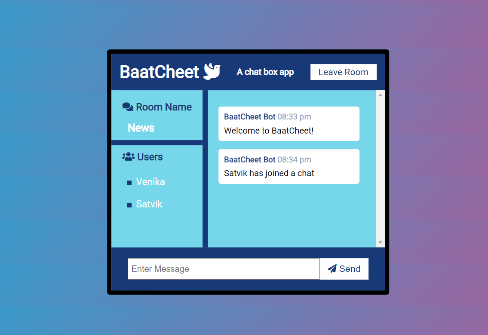

# BaatCheet
Baatcheet in Hindi means having a conversation. I built this realtime chat application Node.js, Express and Socket.io. It has a CSS gradient animated background. It has different conversation rooms with different topics that people can join. It supports multiple users and people can leave a chat room and join another one.

# Demo
To try out the app, visit https://baatcheet-chat-app.herokuapp.com/     
Open it in multiple browser tabs and join chat rooms as different users to send messages back and forth. 

# Installation
To run the app for yourself, clone the directory. After that, run the following commands in terminal-    
npm install    
npm run dev     
To see the app running, go to localhost:3000    

# Screenshots
     
   

# Helpful links
* https://socket.io/get-started/chat/     
* https://devcenter.heroku.com/articles/getting-started-with-nodejs#set-up      
* https://coolors.co/
