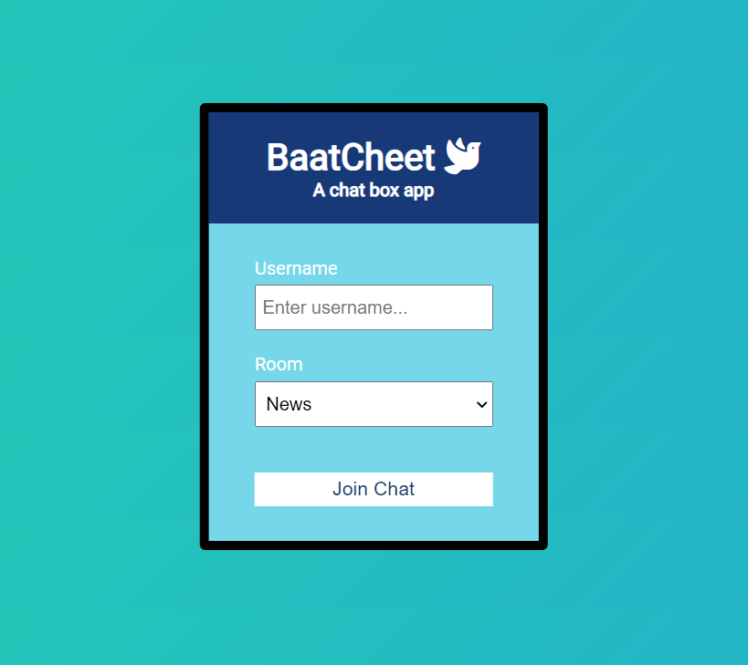

# BaatCheet
The word Baatcheet in Hindi language means having a conversation. I built this realtime chat application Node.js, Express and Socket.io. It has different conversation rooms with different topics that users can join. It supports multiple users and allows them to leave a chat room and join another one.

# Demo


https://github.com/Venika/BaatCheet/assets/26017954/600719cb-5a33-493b-abcb-0385734e29ae


# Installation
To run the app for yourself, clone the directory. After that, run the following commands in terminal-    
```
npm install    
npm run dev 
```
To see the app running, go to localhost:3000    

# Screenshots
     
       

# Future updates
I would like to add user authorization and maybe some sort of database to the application. 

# Helpful links
* https://socket.io/get-started/chat/         
* https://coolors.co/
